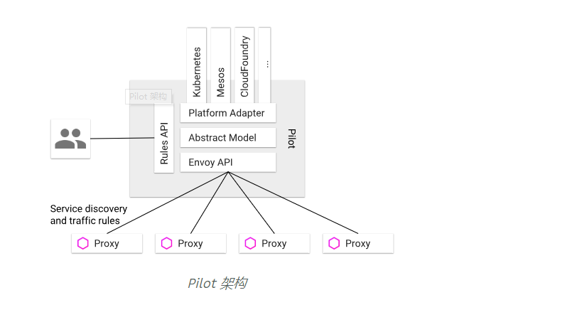

### 简介
  Istio 作为service messh开源项目，其中最重要的功能就是对网格中微服务之间的管理，
  包括服务发现，请求路由和服务间的可靠通信。Istio实现了service mesh的控制面，
  并整合Envoy开源项目作为数据面的sidecar，一起对流量进行控制。

   Istio控制面中负责流量管理的组件为Pilot，Pilot的高层架构如下图所示
   

   Pilot 主要实现的以下功能:
   统一的服务模型

   标准数据面API

   业务DSL语言

### Istio流量管理相关组件
#### 控制面组件
  Discovery Services
  对应的docker镜像：gcr.io/istio-release/piolot,进程为pilot-discovery,该组件的功能包括：
  - 从Service provider(如Kuebernetes或者consul)中获取服务信息
  - 从K8S-API-SERVER 中获取流量规则(k8s CRD resource)
  - 将服务信息和流量规则转化为数据平面可以理解的格式,通过标准的数据面API下发到网格中的各个sidecar中

#### K8S API SERVER 提供Pilot相关的CRD Resource的增、删、改、查。和Pilot相关的CRD有以下几种:
- Virtualservice：用于定义路由规则，如根据来源或 Header 制定规则，或在不同服务版本之间分拆流量。

- DestinationRule：定义目的服务的配置策略以及可路由子集。策略包括断路器、负载均衡以及 TLS 等。

- ServiceEntry：用 ServiceEntry 可以向Istio中加入附加的服务条目，以使网格内可以向istio 服务网格之外的服务发出请求。

- Gateway：为网格配置网关，以允许一个服务可以被网格外部访问。

- EnvoyFilter：可以为Envoy配置过滤器。由于Envoy已经支持Lua过滤器，因此可以通过EnvoyFilter启用Lua过滤器，
动态改变Envoy的过滤链行为。我之前一直在考虑如何才能动态扩展Envoy的能力，EnvoyFilter提供了很灵活的扩展性。

### 数据平面的组件
在数据面有两个进程Pilot-agent和envoy，这两个进程被放在一个docker容器gcr.io/istio-release/proxyv2中。
- Pilot-agent
  该进程根据K8S API Server中的配置信息生成Envoy的配置文件，并负责启动Envoy进程。注意Envoy的大部分配置信息都是通过
  xDS接口从Pilot中动态获取的，因此Agent生成的只是用于初始化Envoy的少量静态配置。在后面的章节中，
  本文将对Agent生成的Envoy配置文件进行进一步分析。
- Envoy
  Envoy由Pilot-agent进程启动，启动后，Envoy读取Pilot-agent为它生成的配置文件，然后根据该文件的配置获取到Pilot的地址，
  通过数据面标准API的xDS接口从pilot拉取动态配置信息，包括路由（route），监听器（listener），服务集群（cluster）
  和服务端点（endpoint）。Envoy初始化完成后，就根据这些配置信息对微服务间的通信进行寻址和路由。

- 命令行工具
  kubectl和Istioctl，由于Istio的配置是基于K8S的CRD，因此可以直接采用kubectl对这些资源进行操作。
  Istioctl则针对Istio对CRD的操作进行了一些封装。Istioctl支持的功能参见该表格。

[Istio流量管理实现机制深度解析](https://mp.weixin.qq.com/s?__biz=MzIwNDIzODExOA==&mid=2650166252&idx=1&sn=759db7a50929ee6bef1eb8cd8f2d8329&chksm=8ec1cfa5b9b646b38999d57172211633d64176bec0206ed35191aad30e503765128819d963a2&scene=21#wechat_redirect)